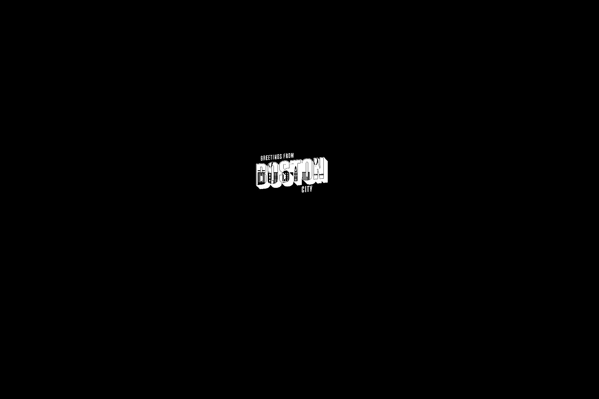

# DES

Official repository for **"DES: A Multi-stage Framework for Accurate Fabric Printed Pattern Segmentation"**.

Both the **code** and the **dataset** will be released **after paper acceptance**.
---

## 📊 Dataset Preview
Here are a few examples from the **FPPS5K dataset**:

| Fabric Image | Segmentation Mask | Pattern |
|--------------|------------------|--------------------|
|  |  |  |
|  |  |  |
|  |  |  |
